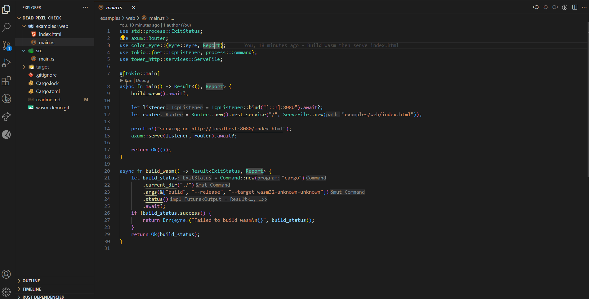

# Dead Pixel Check
## Inspired by [lcdtech's dead pixel check](https://lcdtech.info/en/tests/dead.pixel.htm)
This program will display a solid color to make any dead pixels more obvious. 
Color order: White -> Black -> Red -> Green -> Blue -> White
## Change colors with
- `Spacebar`
- `Any Mouse Button`
- `Touch`
## Close with
- `Escape`

# Examples
- Run on native: `cargo run`
- Spin up a web server that hosts the app's WASM binary: `cargo --example web`
  - Note: to add wasm32-unknown-unknown target run `rustup target add wasm32-unknown-unknown`

The index.html in the examples/web folder should work with any macroquad WASM binary

